# EBOA: Engine for Business Operation Analysis #

This component is the data storage management tool for the Business Operation Analysis.
The data management makes use of a data model containing the following main entities:

1. **Events**: periods of time associated to a gauge of a certain aspect business-related

2. **Annotations**: particular aspects associated to an explicit reference

3. **Explicit references**: identifiers referring to an entity business-related

4. **Sources**: blocks of information received from external interfaces to process; after processing, interesting information is extracted and stored

5. **Alerts**: notifications to users regarding anomalies identified by the system related to previous entities

6. **Reports**: containers of analysis

## Purpose ##

EBOA (Engine for Business Operation Analysis) serves as a comprehensive data storage and management platform designed to handle complex business operation data with maximum flexibility and efficiency. It provides a robust foundation for storing, retrieving, and analyzing time-tagged information without requiring predefined schemas or extensive configuration.

The system is built around the following core requirements and capabilities:

### Data Integrity and Traceability ###
- **Complete traceability**: All data maintains full traceability to its source of information, including data generated within the infrastructure itself
- **Source validation**: Ensures data provenance and reliability through comprehensive source tracking

### Flexibility and Adaptability ###
- **Schema-less insertion**: No pre-configuration required for inserting new types of data
- **Dynamic data structures**: Supports flexible linking between events, annotations, and explicit references
- **Modern data types**: Includes contemporary data types for comprehensive data storage capabilities

### Performance and Scalability ###
- **Parallel processing**: Leverages RDBMS parallelism mechanisms for efficient data insertion
- **Geo-query support**: Includes geospatial query functionalities for location-based analysis
- **Dynamic access**: Enables quick, on-demand access to information based on user requirements

### Development and Operations ###
- **Continuous development**: Follows continuous development and continuous integration practices
- **Structured data access**: Provides organized, structured access to stored information for effective management

## Scope ##

EBOA is designed for enterprise and analytical systems that require robust storage and management of time-series and time-tagged business data. It excels in environments where data complexity, volume, and dynamic requirements demand a flexible, scalable solution.

### Target Systems ###
- Real-time business operation monitoring and analysis platforms
- Event-driven architectures requiring centralized data storage
- Multi-source data aggregation systems
- Complex business intelligence and reporting platforms
- Systems requiring dynamic schema adaptation without downtime

### Supported Operations ###
- Insertion, update, and deletion of events, annotations, and related business entities
- Complex queries across multi-dimensional business data
- Flexible linking and relationship management between different data types
- Annotation and enrichment of business operations data
- Alert generation and reporting on business events

### Data Model Characteristics ###
- Optimized for time-tagged information with comprehensive temporal tracking
- Hierarchical data organization enabling quick structured access
- Support for complex data types including geometric/location data
- Dynamic value structures supporting unlimited data dimensionality
- Maintains referential integrity while providing maximum flexibility

### Integration Capabilities ###
- Multi-format data input support (XML, JSON, Python dictionaries)
- Schema-based validation ensuring data quality
- Parallel data processing leveraging modern database capabilities
- Priority-based data conflict resolution
- Scalable for high-volume, concurrent data operations

## Data Management ##

EBOA provides comprehensive capabilities for managing data throughout its lifecycle, from initial orchestration and ingestion through storage and retrieval. This section covers input orchestration and triggering mechanisms, the data ingestion pipeline, various insertion methods at different hierarchical levels, and the underlying data model that supports flexible, schema-less data management.

### Input Orchestration ###

EBOA implements a sophisticated input orchestration system that manages the ingestion of data from multiple external sources in parallel while maintaining strict data consistency. The system provides intelligent file-based triggering, concurrent processing, and robust synchronization mechanisms to handle high-volume, multi-source data ingestion scenarios. The image bellow summarizes the input orchestration process (note that BOA relies in other components like [DEC](https://github.com/borjalopezfernandez/dec), [ORC](https://github.com/borjalopezfernandez/dec) and [minArc](https://github.com/borjalopezfernandez/minarc) for providing the complete orchestration strategy).

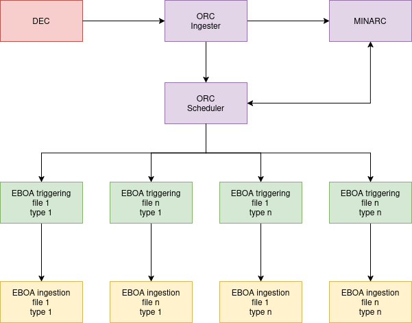

#### Triggering Mechanism ####

EBOA's triggering system provides flexible, configuration-driven activation of ingestion processes:

- **File-Based Detection**: Incoming files trigger ingestion processes based on configurable pattern matching rules defined in `triggering.xml`
- **Rule-Driven Execution**: Each matched rule can specify custom commands to execute, enabling integration with diverse data sources and ingestion processors
- **XPath-Based Matching**: Advanced rule matching using XPath expressions for filename patterns and content analysis
- **Conditional Processing**: Rules support conditional execution (skip modes) for files that require registration without triggering processing
- **Dynamic Command Execution**: Commands are executed in isolated processes with proper error handling and logging

#### Parallel Input Processing ####

EBOA is architected to robustly digest multiple inputs in parallel while ensuring data consistency:

##### Concurrency Architecture #####

- **Source-Level Locking**: Each data source is protected by a synchronized lock based on source name using `lockutils.synchronized_with_prefix('eboa-')`
  - Prevents concurrent processing of the same source file
  - Ensures sequential consistency for inter-source dependencies
  - Uses external mutex locks stored in `/dev/shm` for inter-process synchronization

- **Thread-Safe Database Access**: 
  - Thread-safe database sessions via `scoped_session(Session)` for each ingestion process
  - Isolated database connections prevent session conflicts
  - PostgreSQL configured for high-concurrency scenarios (`max_connections=5000`, `max_locks_per_transaction=5000`)

- **Parallel Ingestion Limits**:
  - Configurable `MAXIMUM_PARALLEL_INGESTIONS` parameter controls concurrent load
  - Queue-based scheduling ensures system resources aren't overwhelmed
  - Automatic monitoring prevents exceeding configured limits

##### Process Synchronization #####

The system implements multiple layers of synchronization to coordinate parallel ingestions:

- **Fair Lock Distribution**: Lock mechanisms prevent starvation of waiting ingestion processes
- **Dependency Blocking**: Ingestions can block on external dependencies until blocking sources complete
- **Progress Tracking**: Active ingestions are tracked in shared memory folders for visibility and management
- **Clean Shutdown**: Proper cleanup of ingestion markers ensures system consistency even after failures

#### Data Consistency Guarantees ####

EBOA maintains strict ACID properties across parallel ingestions through sophisticated mechanisms:

##### Transactional Integrity #####

- **Atomic Operations**: All ingestion operations wrapped in database transactions with complete rollback on errors
- **Savepoint Handling**: Nested transactions (savepoints) provide recovery points for complex multi-step operations
- **Error Isolation**: Failed ingestions are completely rolled back, leaving database in consistent state
- **Status Persistence**: Each ingestion's outcome recorded in `source_statuses` table with detailed tracking

##### Write Conflict Resolution #####

The system employs intelligent algorithms to resolve conflicts between concurrent ingestions:

- **Generation Time Precedence**: When multiple versions arrive simultaneously, earlier-generated data takes precedence
- **Priority-Based Selection**: Insertion methods incorporate priority values to determine data dominance
- **Event Key Deduplication**: The EVENT_KEYS method ensures only highest-generation-time events with same key remain visible
- **Temporal Ordering**: Validity period and generation timestamps ensure causal consistency

##### Mutual Exclusion #####

- **Source-Level Serialization**: Prevents concurrent modification of same source through synchronized locking
- **Transaction Isolation Levels**: PostgreSQL's SERIALIZABLE isolation ensures phantom-read prevention
- **Conflict Detection**: Explicit conflict handling through INSERT_and_ERASE algorithms
- **Invariant Preservation**: All data model constraints maintained through transactions

#### Robustness and Reliability ####

The input orchestration system is engineered for production-grade reliability:

##### Error Handling #####

- **Graceful Degradation**: Failed ingestions don't crash system; errors are logged and tracked
- **Detailed Status Reporting**: Each ingestion generates status records with error messages for operator visibility
- **Exception Recovery**: Caught exceptions prevent cascading failures across multiple ingestions
- **Logging and Audit Trail**: Comprehensive logging enables troubleshooting and compliance

##### Resilience Features #####

- **Progress Checkpointing**: Ingestion progress saved at each step for recovery capability
- **Timeouts and Limits**: Built-in protection against hung processes through configurable timeouts
- **State Persistence**: On-going ingestions tracked persistently, enabling restart and recovery
- **Resource Monitoring**: Real-time monitoring prevents resource exhaustion
- **Performance Tracking**: Ingestion duration and metrics enable performance analysis and optimization

##### Consistency After Failures #####

- **Transaction Rollback**: Incomplete operations automatically rolled back to maintain consistency
- **Idempotent Operations**: Ingestions can be safely retried without creating duplicates
- **State Recovery**: System can identify and handle orphaned ingestion markers
- **Clean Restarts**: Failed ingestion markers cleaned up automatically

### Data Ingestion ###

The data ingestion starts by initializing the insertion context and registering the DIM signature and source associated with the incoming operation. EBOA then inserts the metadata needed by that operation, including gauges, annotation configurations, explicit references, links, and alert configuration data.

Once the context is ready, events and annotations are bulk-inserted. Depending on the configured insertion method, some records become immediately visible while others are inserted as hidden candidates pending conflict resolution. As shown in the diagram above, EBOA then runs a deprecation pass that applies the configured rules, such as generation-time precedence, priority precedence, event-key resolution, or interval splitting.

After deprecated data has been removed, EBOA processes counter updates, writes the final ingestion status, and commits the transaction. The image bellow summarizes that end-to-end path from operation input to finalized visible data.

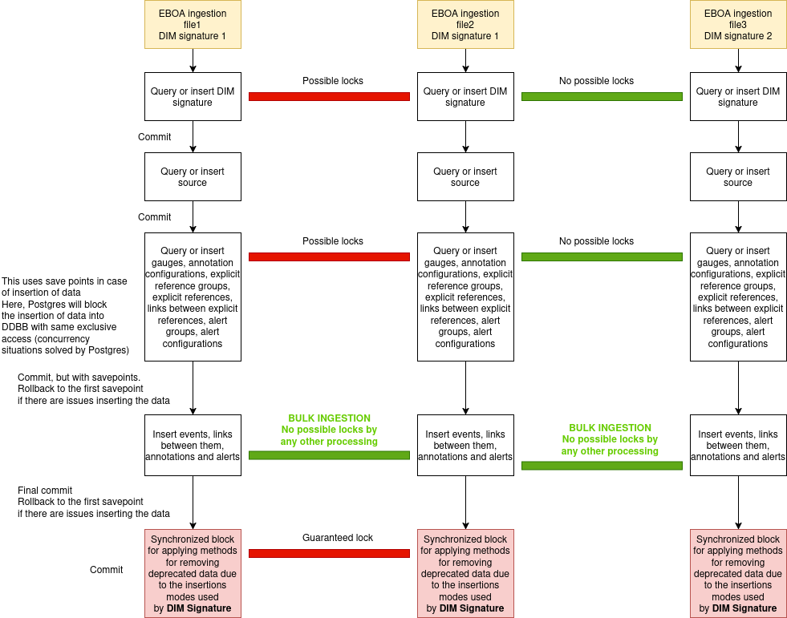

#### Insertion Methods ####

EBOA supports various insertion methods at different hierarchical levels, allowing flexible data management based on different update strategies:

##### Operation Level (DIM Signature) #####

These methods apply to all events and annotations linked to gauges associated with a specific DIM signature:

- **insert**: Basic insertion without any filtering or removal of existing data. Insertion methods at event level are applied.

- **insert_and_erase**: Applies INSERT_and_ERASE logic to all events linked to all gauges associated with the DIM signature.

  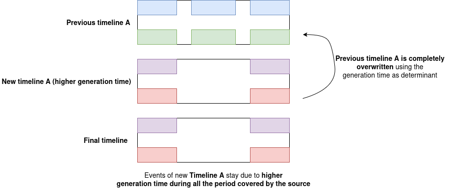

- **insert_and_erase_with_priority**: Same as insert_and_erase but using priority values to determine data relevance.

  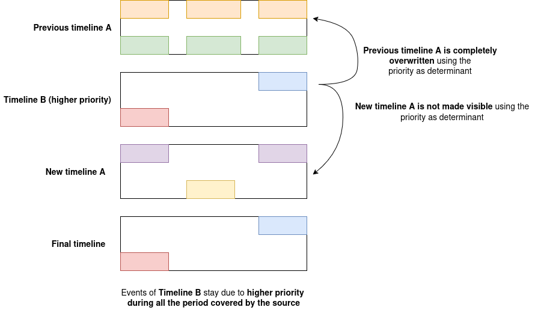

- **insert_and_erase_with_equal_or_lower_priority**: Similar to insert_and_erase_with_priority with specific priority handling.

  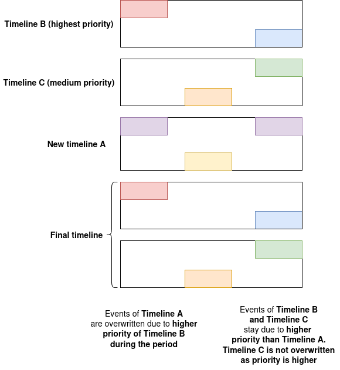

###### Key Behavioral Differences ######

- **Scope**: Operation-level methods apply uniformly to all gauges within a DIM signature, enabling aggregate conflict resolution strategies across multiple events
- **Granularity**: Lacks per-event customization; all events under the DIM signature follow the same insertion and visibility rules
- **Simplicity**: Enables bulk application of insertion policies without individual event configuration
- **Use Case**: Best for homogeneous data sources where all measurements should follow identical conflict resolution strategies

##### Event Level #####

These methods apply to individual events based on their gauge configuration:
Note: these methods are applied if at operation level the mode of insertion is configured as "insert".

- **SIMPLE_UPDATE**: All events are inserted without any filtering or removal.

  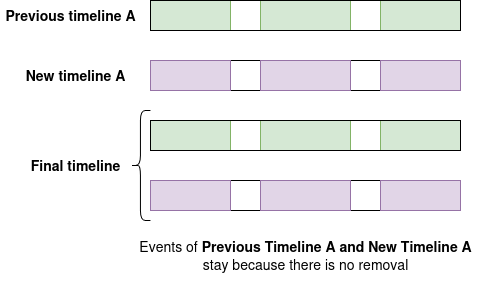

- **INSERT_and_ERASE**: Events are inserted but initially flagged as not visible. The system keeps only events with the greatest generation time within the source's validity period, removing or splitting others as needed.

  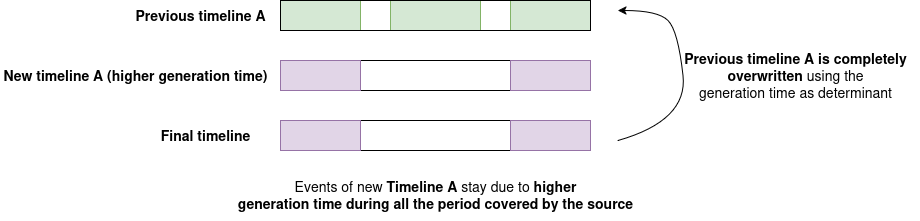

- **INSERT_and_ERASE_with_EQUAL_or_LOWER_PRIORITY**: INSERT_and_ERASE with specific priority comparison logic.

  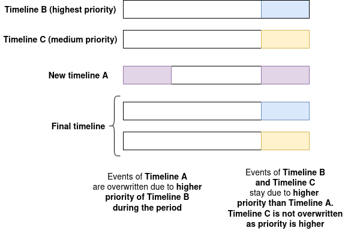

- **INSERT_and_ERASE_with_PRIORITY**: Same as INSERT_and_ERASE, but uses priority values for source relevance.

  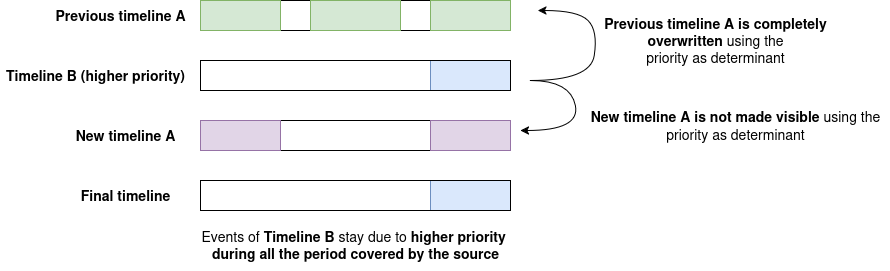

- **INSERT_and_ERASE_per_EVENT**: Similar to INSERT_and_ERASE, but the validity period is determined per individual event rather than the source.

  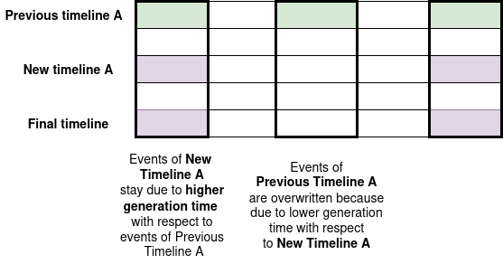

- **INSERT_and_ERASE_per_EVENT_with_PRIORITY**: Combines per-event validity checking with priority-based selection.

  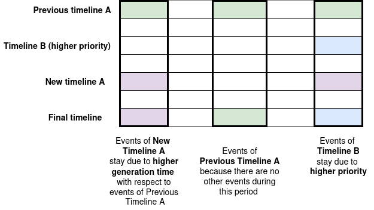

- **INSERT_and_ERASE_INTERSECTED_EVENTS_with_PRIORITY**: Handles intersecting events with priority considerations.

  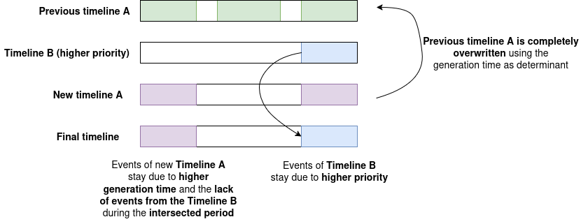

- **EVENT_KEYS**: Events are inserted but flagged as not visible. Keeps events with the same event key and DIM signature that have the greatest generation time.

- **EVENT_KEYS_with_PRIORITY**: Same as EVENT_KEYS, but incorporates priority values.

- **SET_COUNTER**: For counter-type gauges, sets the counter value.

- **UPDATE_COUNTER**: For counter-type gauges, updates the existing counter value.

###### Key Behavioral Differences ######

- **Visibility Model**: SIMPLE_UPDATE makes data immediately visible, while INSERT_and_ERASE variants flag events as hidden candidates pending deprecation pass completion
- **Validity Period Scope**: Source-level variants (INSERT_and_ERASE, INSERT_and_ERASE_with_PRIORITY) apply source validity periods uniformly, while per-event variants (INSERT_and_ERASE_per_EVENT*) determine validity individually for each event
- **Conflict Resolution Strategy**: Generation-time-based methods prioritize earlier-generated data, priority-based methods use source priority rankings, and EVENT_KEYS methods use event key deduplication
- **Counter Operations**: SET_COUNTER and UPDATE_COUNTER are specialized methods for counter-type gauges, distinguishing between initial setting and incremental updates
- **Intersection Handling**: The `INSERT_and_ERASE_INTERSECTED_EVENTS_with_PRIORITY` variant specifically handles overlapping temporal intervals by examining existing events at intersecting time periods, using priority considerations for conflict resolution. This is different from other priority-based methods in that it focuses on **where events actually exist** rather than where a higher-priority source claims coverage.

###### Use Case: Multi-Source Timeline Completeness ######

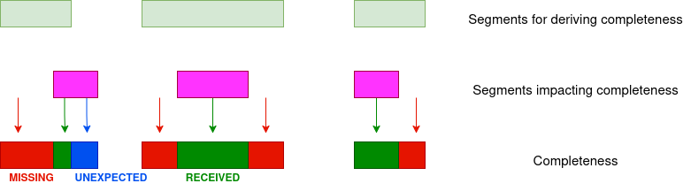

A practical example is determining completeness between planned mission timelines from different sources:

**Scenario**: Two independent sources provide scheduling data:
- **Timeline A (lower priority)**: Expected satellite download activities 
- **Timeline B (higher priority)**: Expected antenna reception activities

The goal is to identify which periods have complete coverage from both timelines.

**Insertion Strategy**:
- Insert Timeline A using `INSERT_and_ERASE_INTERSECTED_EVENTS_with_PRIORITY` (this method)
- Insert Timeline B using `INSERT_and_ERASE_per_EVENT_with_PRIORITY` with higher priority

**Behavior**:
1. When Timeline B is inserted first: Events are stored as-is
2. When Timeline A is then inserted: EBOA reviews each time period where Timeline A has events
   - Previous Timeline A covered by the new Timeline A is completelly removed
   - At intersections where Timeline B also has events: Timeline A events are removed (Timeline B has higher priority)
   - At gaps where Timeline B has NO events: Timeline A events are kept (no competing data)
   - Result: Completeness is automatically calculated—you see the union of both timelines

**Key Difference from `INSERT_and_ERASE_per_EVENT_with_PRIORITY`**:
- **`INSERT_and_ERASE_per_EVENT_with_PRIORITY`**: Removes previous Timeline A covered by the new Timeline A
- **`INSERT_and_ERASE_per_EVENT_with_PRIORITY`**: Removes Timeline A events whenever Timeline B source has higher priority, **regardless of whether Timeline B actually has events** during those periods
- **`INSERT_and_ERASE_INTERSECTED_EVENTS_with_PRIORITY`**: Only removes Timeline A events where Timeline B **actually has conflicting events** at the same time

This distinction is crucial for scenarios where higher-priority sources may have incomplete coverage or gaps in their data. This method ensures you don't lose lower-priority data in periods where the higher-priority source is silent.
- **Granularity vs Performance**: Per-event methods offer maximum granularity but require more processing; source-level methods are more efficient for uniform datasets

##### Annotation Level #####

These methods apply to individual annotations:

- **SIMPLE_UPDATE**: All annotations are inserted without any filtering.
- **INSERT_and_ERASE**: Annotations are inserted with filtering based on validity periods and generation times.
- **INSERT_and_ERASE_with_PRIORITY**: Same as INSERT_and_ERASE for annotations, using priority values.

###### Key Behavioral Differences ######

- **Filtering Complexity**: SIMPLE_UPDATE provides direct insertion without conflict resolution, while INSERT_and_ERASE variants apply temporal and source-based filtering
- **Priority Consideration**: INSERT_and_ERASE_with_PRIORITY uses source priority rankings for conflict resolution, whereas basic INSERT_and_ERASE relies on generation time precedence
- **Use Cases**: SIMPLE_UPDATE suits transient annotations, while INSERT_and_ERASE variants are appropriate for long-lived descriptive metadata requiring temporal consistency
- **Consistency Guarantees**: Both filtered variants maintain consistency within validity periods; the choice between them depends on whether source priority or temporal ordering is the primary conflict criterion

### Data Model ###

#### Overview ####

EBOA implements a comprehensive relational data model designed to handle complex business operation data with maximum flexibility and temporal awareness. The data model is based on a solid relational foundation while supporting dynamic, schema-less value structures for unlimited data dimensionality.

The main entities managed by EBOA are:

- **Events**: Time-bounded measurements or observations of business operations
- **Annotations**: Descriptive information or properties associated with explicit references
- **Explicit References**: Unique identifiers for business entities (objects, systems, locations, etc.)
- **Sources**: Raw data ingestion sources and their metadata
- **Alerts**: Notifications triggered by system conditions or business rules
- **Reports**: Containers for analysis results and business intelligence outputs

#### Entity Relationships ####

The EBOA data model defines complex relationships between entities:

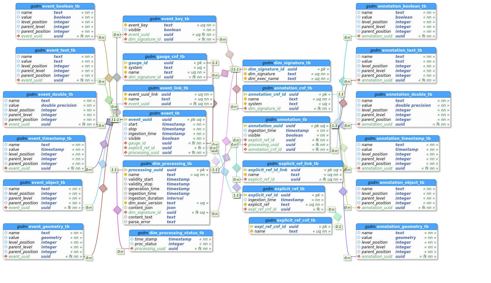

Key relationships include:

- **Events to Explicit References**: Events can be associated with specific business entities
- **Events to Events**: Events can be linked to other events to represent causal or temporal relationships
- **Events to Gauges**: Each event is measured through a gauge configuration defining insertion behavior
- **Annotations to Explicit References**: Annotations enrich business entities with descriptive information
- **All Entities to Sources**: Complete traceability tracking which source generated each entity
- **All Entities to Alerts**: Alert generation and tracking at entity level

#### Dynamic Value Structures ####

One of EBOA's most powerful features is the support for dynamic, hierarchical value structures. Events and annotations can contain arbitrarily complex nested data without schema modification.

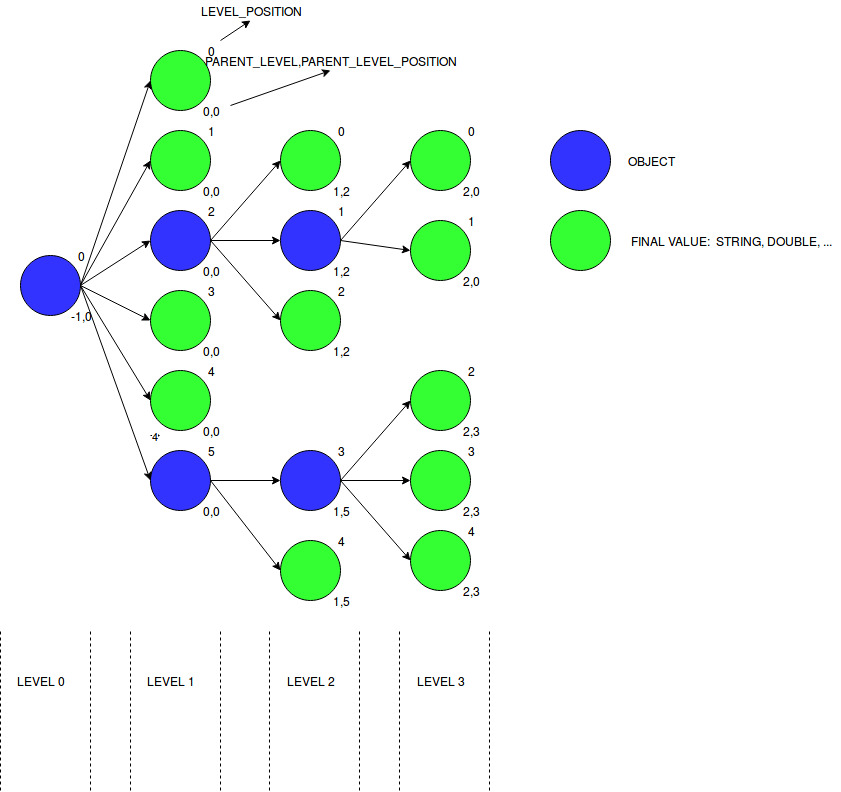

##### Supported Data Types #####

Values can be of the following types:

- **Text**: String values of any length
- **Boolean**: True/False values
- **Double**: Floating-point numeric values
- **Timestamp**: Date and time values
- **Geometry**: Geographic/spatial data (points, polygons, etc.)
- **Object**: Containers for nested hierarchical structures

##### Value Structure Organization #####

The dynamic value tree is organized hierarchically with the following characteristics:

- **Level-based hierarchy**: Each value has a `level_position` indicating its depth in the tree
- **Parent references**: Values maintain references to their parent through `parent_level` and `parent_position`
- **Unique addressing**: The combination of level and position enables unique identification of any value in the structure
- **Tree constraints**: Parent nodes must be of type "Object", while leaf nodes must be non-Object types
- **Unlimited nesting**: Values can contain other values, creating arbitrarily deep hierarchical structures

This design allows EBOA to store complex, semi-structured business data while maintaining full relational integrity and queryability.

#### Temporal Tracking ####

EBOA maintains comprehensive temporal metadata for all entities:

- **Generation time**: When data was originally created
- **Reception time**: When data was received by EBOA
- **Processing time**: When data was processed
- **Validity period**: Start and stop times for which data is valid
- **Reported times**: Original times as reported by source systems

This enables sophisticated temporal queries and analysis of business operations over time.

## Full Stack Application: EBOA + VBOA ##

While EBOA serves as a powerful backend data management engine, it is designed to work seamlessly with **VBOA** (Visualization for Business Operation Analysis), a modern frontend component that completes the full-stack application architecture.

### Architecture Overview ###

The EBOA + VBOA stack provides an enterprise-grade solution for business operation analysis:

- **EBOA (Backend)**: Data storage, management, and query engine built on PostgreSQL with Python API
- **VBOA (Frontend)**: Interactive web application for visualization, analysis, and real-time monitoring

Together, these components form a complete, production-ready platform for complex business operation management without requiring extensive custom development.

### Easy Tailoring Structure ###

One of the key advantages of the EBOA + VBOA stack is its easily customizable architecture:

- **Modular design**: Both components are designed with modularity in mind, allowing you to extend and customize functionality
- **Configuration-driven**: Most features are driven by configuration files rather than code changes
- **Data model adaptation**: Define your own entities and relationships through EBOA's flexible schema
- **UI customization**: VBOA's interface can be tailored to your specific business needs
- **Integration points**: Well-defined APIs and integration points for connecting custom processors and analyzers

### Getting Started ###

To get started with the full EBOA + VBOA stack:

1. **EBOA Documentation**: This repository contains comprehensive documentation for the backend component
2. **VBOA Repository**: Visit the GitHub repository for VBOA to access the frontend component and additional examples:  
https://github.com/Daniel-Brosnan-Blazquez/vboa

3. **Examples**: Complete reference implementations and example configurations demonstrating typical use cases (e.g. monitoring of observation satellites, financial analysis, etc) are available in the GitHub repositories:  
https://github.com/Daniel-Brosnan-Blazquez/s1boa
https://github.com/Daniel-Brosnan-Blazquez/s2boa
https://github.com/Daniel-Brosnan-Blazquez/s3boa
https://github.com/Daniel-Brosnan-Blazquez/bankboa

## Integrations ##

### Prometheus Metrics Integration ###

EBOA can provide real-time metrics to Prometheus, enabling seamless integration with modern monitoring and observability stacks. The system leverages Prometheus' pull-based metrics collection model to expose operational metrics and system performance indicators from the EBOA engine and associated BOA components.

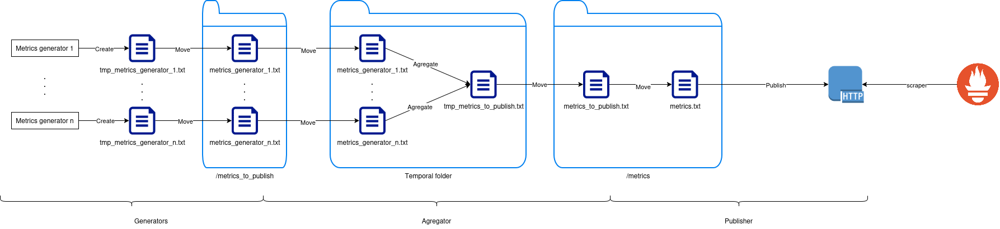

The Prometheus integration enables:

- **Real-time monitoring**: Continuous collection of EBOA operational metrics
- **Performance tracking**: Monitor engine throughput, query performance, and data processing rates
- **System health**: Track resource utilization, database performance, and system status
- **Historical analysis**: Leverage Prometheus' time-series database for metric analysis and alerting
- **Grafana dashboards**: Create customized dashboards for visualization and business intelligence
- **Alert generation**: Define Prometheus alert rules based on EBOA metrics thresholds

This integration allows operators to maintain comprehensive visibility into EBOA operations and quickly identify performance bottlenecks or anomalies in the system.
